# Rmbr Assistant
Made by [Florian Wilisch](https://github.com/florian-wilisch) and [Adam Lee Osgood](https://github.com/adwam12).

## Overview
The final project at GA was to create a full-stack web application. This two-person, week-long project utilised a Python Flask RESTful API. Rmbr Assistant was born out of the idea that gift shopping for individuals is so hard. Everytime we think of a good gift idea, we forget about it by the time a birthday comes up. We wanted to create a voice assistant that could keep track of the individual likes and hobbies of an individual and remind you of them a month before a birthday.

Link: [Rmbr](https://project-4-rmbr.herokuapp.com/)

## Technologies
* React
* Python
* Flask
* Google Dev Tools
* Auth 2.0
* Git and GitHub
* Marshmallow
* PostgreSQL
* SQLAlchemy
* TablePlus
* Google API

## Requirements
​* Build a full-stack application by making your own backend and your own front-end

* Use a Python Flask API using a Flask REST Framework to serve your data from a Postgres database
* Consume your API with a separate front-end built with React
* Be a complete product which most likely means multiple relationships and CRUD functionality for at least a couple of models
* Implement thoughtful user stories/wireframes that are significant enough to help you know which features are core MVP and which you can cut
* Have a visually impressive design to kick your portfolio up a notch and have something to wow future clients & employers. ALLOW time for this.
* Be deployed online so it's publicly accessible.
* A working app hosted on the internet
* A link to your hosted working app in the URL section of your Github repo
* A git repository hosted on Github, with a link to your hosted project, and frequent commits dating back to the very beginning of the project

## Planning
The first step of the process was to plan and outline all the desired features. We separated them into MVP (minimal viable product) and stretch goals. We then kept track of this document for a to-do list and to record bug fixes and our progress.

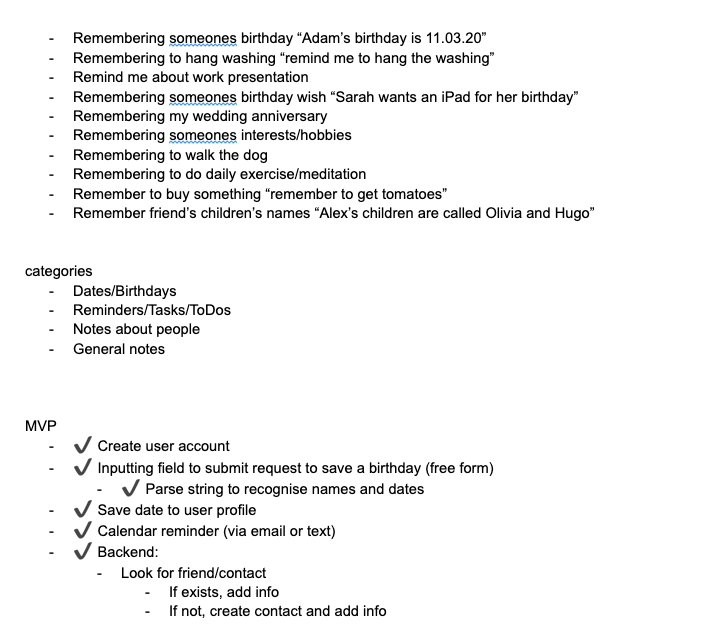
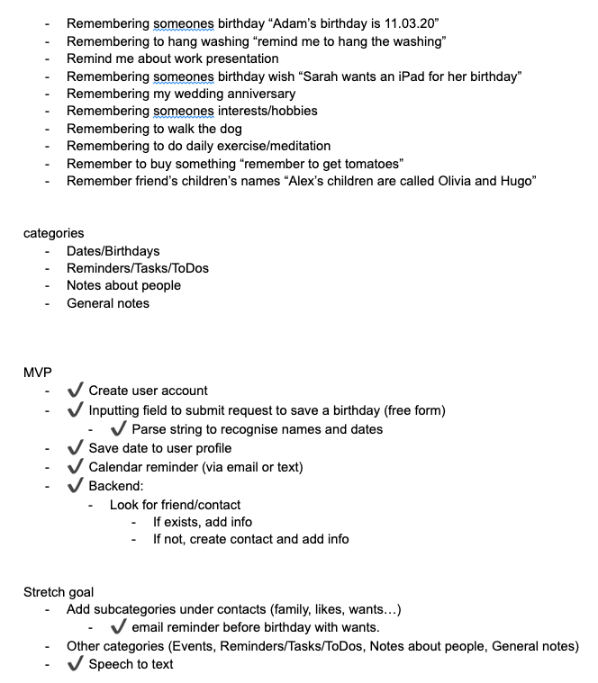
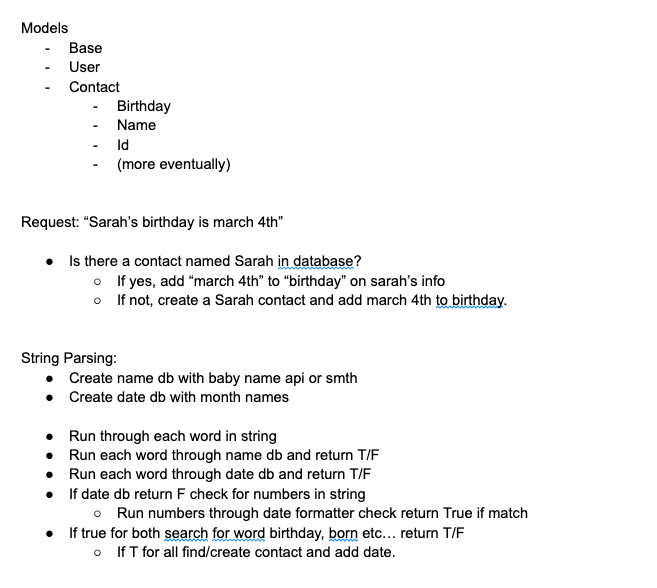
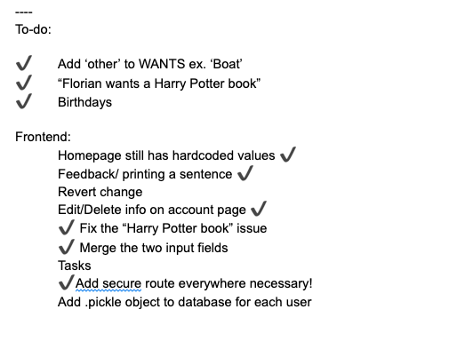

## Inner workings
We needed some way of getting user input, and extracting and categorizing different words, such as names, dates, objects and interests. We found the Google Natural Language API to be perfect for this. We could feed it a string, and it would return an array with each word categorized. We could then take this string and format the info to fit our backend models:

	
	  useEffect(() => {
	    for (let i = 0; i < natLangResult.length; i++) {
	      const element = natLangResult[i]
	      if (element['type'] === 'PERSON') {
	        setCurrentContact(element['name'])
	      }
	      if (element['type'] === 'EVENT') {
	        if (element['name'] === 'birthday') {
	          setCurrentEvent(element['name'])
	          requestType.push('BIRTHDAY')
	          console.log(requestType)
	        }
	      }
	      if (element['type'] === 'DATE') {
	        let day = element['metadata']['day']
	        let month = element['metadata']['month']
	        let year = ''
	        if ((element['metadata']['year'])) {
	          year = element['metadata']['year']
	        }
	        if (Number(element['metadata']['day']) < 10) {
	          day = '0' + element['metadata']['day']
	        }
	        if (Number(element['metadata']['month']) < 10) {
	          month = '0' + element['metadata']['month']
	        }
	        if (year === '') {
	          setCurrentBirthday(day + '/' + month)
	          setBirthdayDay(day)
	          setBirthdayMonth(month)
	        } else {
	          setCurrentBirthday(day + '/' + month + '/' + year)
	        }
	
	        console.log(day + '/' + month + '/' + year)
	      }
	      if ((element['type'] === 'CONSUMER_GOOD') || (element['type'] === 'WORK_OF_ART') || (element['type'] === 'OTHER')) {
	        // setCurrentWant(element['name'])
	        console.log(element['name'])
	        wantsList.push(element['name'])
	      }
	    }
	    if (wantsList.length > 0) {
	      setCurrentWant(wantsList)
	      console.log()
	    }
	  }, [natLangResult])
	  
The above code was the starting point for any request. It checks what type of request was just made, and runs the appropriate function for each item in the request. Below is an example for a contact want:

	
	  function addContactWant(id, want) {
	    console.log('API | GET: grabbing specific contact')
	    axios.get(`/api/contacts/${id}`, {
	      headers: { Authorization: `Bearer ${token}` }
	    })
	      .then(resp => {
	        const currentWant = resp.data['wants']
	        for (let i = 0; i < want.length; i++)
	          if (currentWant.includes(want[i]) === false) {
	            currentWant.push(want[i])
	          }
	        console.log('WANT TEST:', typeof want)
	        axios.put(`/api/contacts/${id}`, {
	          'name': resp.data['name'],
	          'wants': currentWant
	        }, {
	          headers: { Authorization: `Bearer ${token}` }
	        })
	        console.log('API | PUT: adding want to contact')
	        console.log(`Added ${want} to ${resp.data['name']}'s wishlist`)
	        if ((wantsList.length > 1) || (currentWant.length > 1)) {
	          setPrint(`Added multiple items to ${capitalizeFirstLetter(resp.data['name'])}'s Wishlist/Likes`)
	        } else {
	          setPrint(`Added ${want[0]} to ${capitalizeFirstLetter(resp.data['name'])}'s Wishlist/Likes`)
	        }
	      })
	  }
All of this worked perfectly to keep track of our contacts, creating new ones if necessary, and keeping track of each contacts interests. The pseudo code was quite simple: 

* If we detect a name in the string check if its a name already in our contact list
	* if true, and string contains a want or birthday, add it to that contact info
	* if false, create contact and if string contains a want or birthday, add it to that contact info

We then added a library to record voice and use that audio to create a string. This gives the user the option of either typing his request, or dictating it to the assistant. 

## Google Calendar
By far the most ambitious part of the project was our desire to have the assistant seemlessly add a new contact, birthday and want to the user's calendar, and remind them of the event. This would require the user to attach their Rmbr account to their Google account, which required us to learn about Google Auth 2.0 and the Google Dev Tools.

Google requires it's developers to be authenticated and handle user information in a very specific way. The google authentication flow for a user would be as followed:

1.  The user would click "Attach Google Calendar", which would create a unique token (a key) for that user and would be temporarily stored in our database. 
2.  The user is then automatically redirected to the google login page, where upon logging in, would ask them to give Rmbr access to their calendar.
3. 	 This would create a second token on Google's server (a lock), and the lock would be sent to our backend. 
4. 	 Our backend would then verify that the key token matches the lock token. If so, the user has successfully authenticated, and never has to repeat the process.

Below is the code to handle the first part of this operation, it checks if the user needs authentication, and redirects them to google login if so:

	@router.route('/calendar_actions/<int:id>', methods=['GET','POST'])
	def handle_google_calendar(id):
	  event_request = request.get_json()
	  print("EVENT RESULT HERE:", event_request)
	  flask.session['userID'] = id
	  result = db.engine.execute(f"""SELECT "google_Auth_Token" FROM users WHERE id = {id};""")
	  for i in result:
	    if i[0] == 'Unregistered':
	      print("IT IS!!")
	      # return flask.redirect(f'authorize')
	      # resp = flask.make_response()
	      # resp.headers["custom-header"] = "custom"
	      return flask.redirect('https://project-4-rmbr.herokuapp.com/api/calendar_actions/authorize')
	      # return flask.redirect('https://127.0.0.1:5000/api/calendar_actions/authorize')
	
	
	  result = db.engine.execute(f"""SELECT "google_Auth_Token" FROM users WHERE id = {id};""")
	  for i in result:
	    # print('TEST CREDS:', i[0])
	    credentials = google.oauth2.credentials.Credentials(
	          **json.loads(i[0]))
	
	  service = googleapiclient.discovery.build(
	      API_SERVICE_NAME, API_VERSION, credentials=credentials)
	
	  now = datetime.datetime.utcnow().isoformat() + 'Z' # 'Z' indicates UTC time
	  print('Getting the upcoming 10 events')
	  events_result = service.events().list(calendarId='primary', timeMin=now,
	                                      maxResults=10, singleEvents=True,
	                                      orderBy='startTime').execute()
	
	
	
	  # Save credentials back to session in case access token was refreshed.
	 
	  flask.session['credentials'] = credentials_to_dict(credentials)
	  print('_________________________PRINT TEST_____________')
	  print('event_request:', event_request)
	  print('_________________________PRINT TEST END_____________')
	  print("USER TOKEN INFO", db.engine.execute(f"""UPDATE users SET "google_Auth_Token" = '{json.dumps(flask.session['credentials'])}' WHERE id = {id};"""))
	
	  if event_request is not None:
	    print('SUBMITTING TO CALENDAR...', event_request)
	    event_request = service.events().insert(calendarId='primary', body=event_request).execute()
	    
	    
	
	    add_event = service.events().insert(calendarId='primary', )
	
	
	  events = events_result.get('items', [])
	  if not events:
	        print('No upcoming events found.')
	  for event in events:
	      start = event['start'].get('dateTime', event['start'].get('date'))
	      print(start, event['summary'])
	
	  return 'Successfully connected rmbr to your google calendar! You can close this tab now!', 200

Once the user is authenticated, and we have permission to create events to their calendar, the rest is as simple as sending a POST request to the calendar api using a JSON object to store the desired information, and time to be reminded at:

	  function sendToCalendar() {
	    if ((requestType.includes('BIRTHDAY')) && (currentBirthday !== 'None')) {
	      setTimeout(() => {
	        axios.get(`/api/calendar_actions/${userId}`)
	          .then((resp) => {
	            console.log('RESP DATA:', resp.data)
	            if (resp.data[0] === 'S') {

              axios.post(`/api/calendar_actions/${userId}`, {
                'summary': `${capitalizeFirstLetter(currentContact)}'s birthday!`,
                'description': `${currentContact}'s Wishlist: ${strTest}`,
                'start': {
                  'dateTime': `2021-${birthdayMonth}-${birthdayDay}T14:30:00`,
                  'timeZone': 'Europe/Zurich'
                },
                'end': {
                  'dateTime': `2021-${birthdayMonth}-${birthdayDay}T17:00:00`,
                  'timeZone': 'Europe/Zurich'
                },
                'reminders': {
                  'useDefault': false,
                  'overrides': [
                    { 'method': 'email', 'minutes': 40320 },
                    { 'method': 'popup', 'minutes': 40320 }
                  ]
                }
              })
            }
          })
      }, 2000)

     }
	}
## Wins and Takeaways
* Learning to use the Google APIs (Natural Language API)
* Learning and implementing Auth 2.0 token flow
* Automatic calendar event creation
* Learning to implement and use an SQL database

## Future Features
* Adding non contact-driven reminders (remind me to do laundy)
* Adding family connections (buy a gift for Elliot's daughter)
* Adding last names
	
## Challenges
* Extracting meaning from the prompt string
* Implementing voice to text
* Learning and applying Google Auth
* Getting Google calendar access

## Screenshots
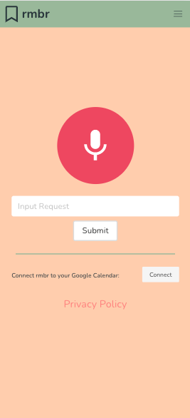
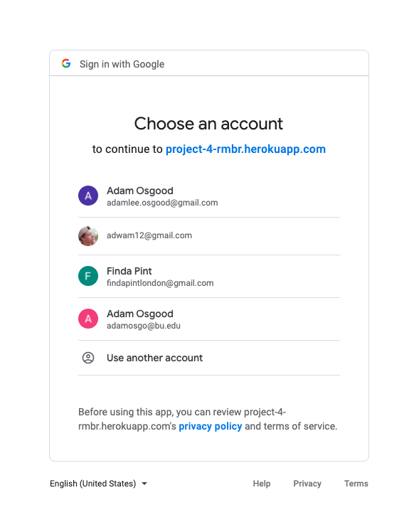
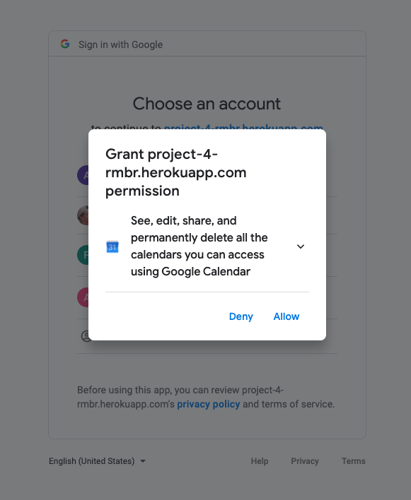
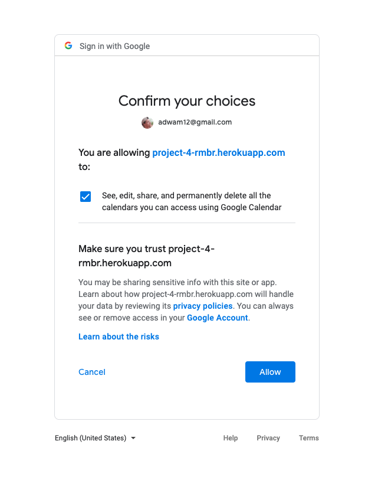
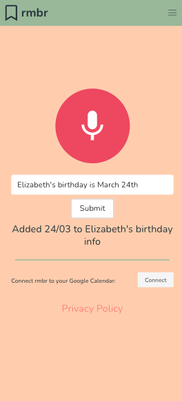
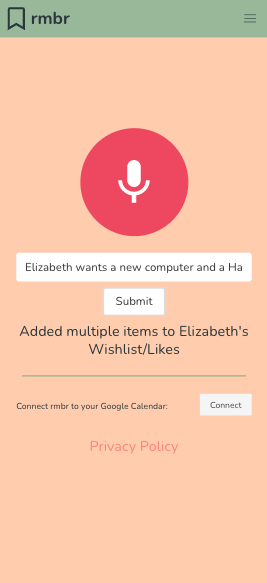
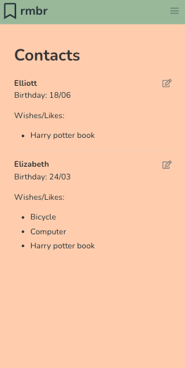
